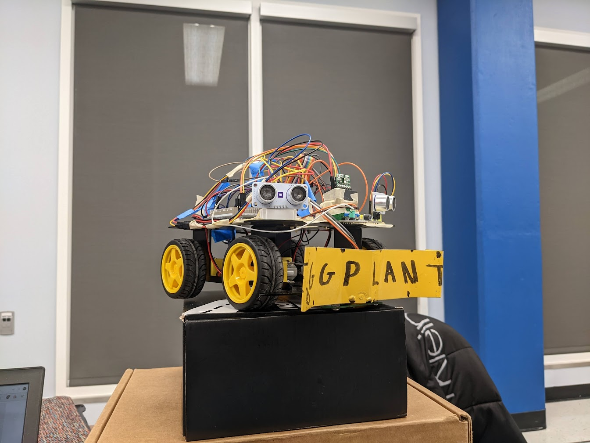
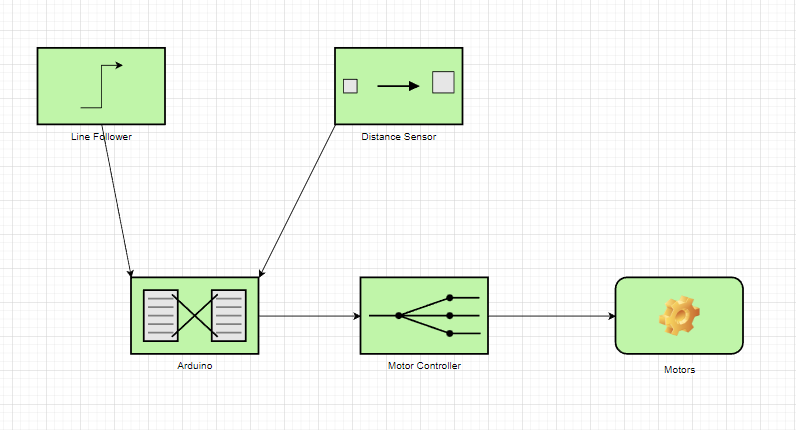
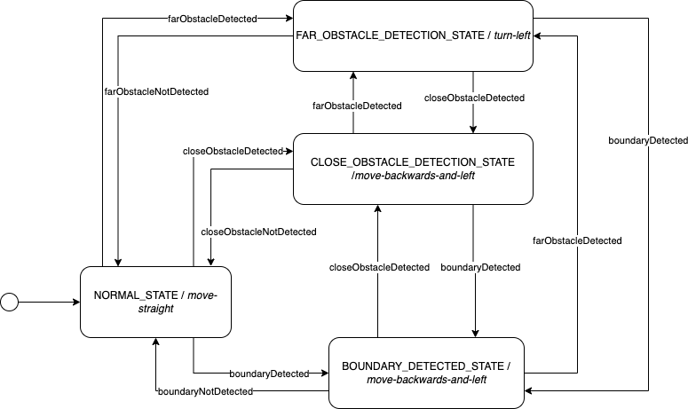

# SYSC 4805 - Computer Systems Design Lab
## Autonomous Snowplow

### Group: L1-G3
Raiyan Hasan  
Kenny Deng  
Paul Okenne 

## Project Description & Summary
A PDF copy of the Project Description can be found [here](docs/ProjectDescription.pdf).

The task of your robot is to clear the snow off an area enclosed by a closed black path. The area will contain some fixed obstacles and some moving obstacles. The robot is required to complete its task without hitting obstacles. In our indoor testing arena, the black path is a black painter’s tape, the obstacles are boxes and other moving robots, and the snow is simulated with lightweight, plastic balls.

You should build your robot after the following specifications as mentioned in the [Project Description PDF](docs/ProjectDescription.pdf).

The team will be graded based on the remaining number of snowballs within the area after the simulation time is complete and the number of times the robot hits an obstacle. Each hit of an obstacle will be equivalent to missing 20 snowballs.

## Final Report PDF
A PDF copy of our Final Report can be found [here](docs/FinalReport.pdf).

## Repo Description
The following is a breakdown of the repository structure that details where the source files for each software application are located.

### [main](main)
Directory contains the source files for the main, obstacle, and boundary modules.

### [Main Module](main/main.ino)
Contains the source file for the main module. Controls logic and state of the Robot.

### [Obstacle Module](main/obstacle-module.ino)
Contains the source file for the obstacle module. Detect obstacles and change the obstacle state of the Robot.

### [Boundary Module](main/boundary-module.ino)
Contains the source file for the boundary module. Detect boundaries and change the boundary state of the Robot.

## Overall System Architecture

## State Diagram

## Sequence Diagram

